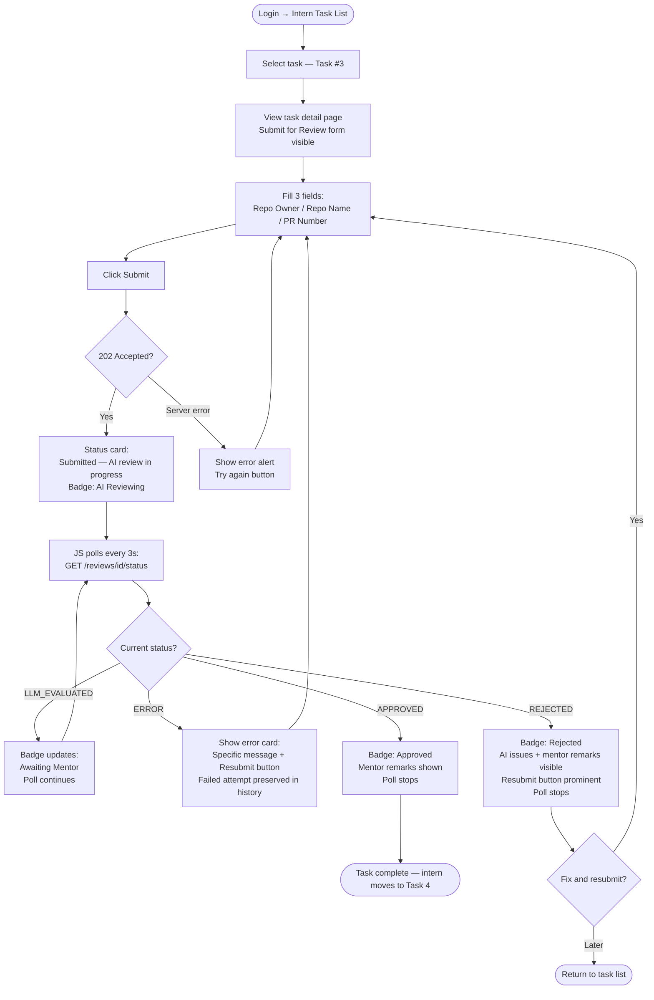
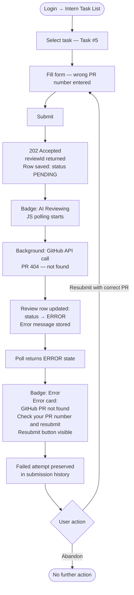
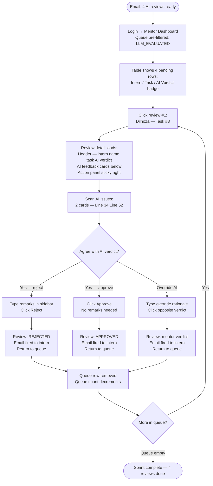
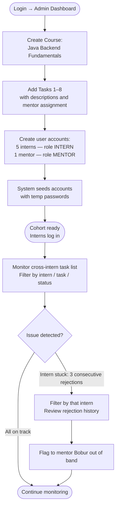

# UX Design Specification examin-ai-with-bmad

**Author:** Ulugbek
**Date:** 2026-04-19

---

<!-- UX design content will be appended sequentially through collaborative workflow steps -->

## Executive Summary

### Project Vision

ExaminAI is a web-based code review platform that eliminates the mentor bottleneck in intern training programs. Interns submit GitHub pull requests for assigned tasks; a locally-hosted AI (deepseek-r1:8b via Ollama) produces structured, line-level feedback within 90 seconds; mentors review the AI draft and make the final approve/reject decision. The AI never replaces mentor judgment — it replaces their reading time. Human accountability is preserved; the bottleneck is eliminated.

The platform runs as a server-side MPA (Spring MVC + Thymeleaf) with three role-based view sets (Intern, Mentor, Admin). The async review pipeline (submit → 202 Accepted → 3-second polling → terminal state) is the central UX challenge and the defining interaction of the product.

### Target Users

**Interns** (e.g., Dilnoza) — software development trainees working through a structured curriculum. Motivated but anxious about code quality. They hate uncertainty while waiting and need to know exactly where their submission stands at every moment. Their success event is a single word: **APPROVED**.

**Mentors** (e.g., Bobur) — senior developers mentoring 8+ interns simultaneously. Time is their scarcest resource. They resent tasks that take longer than they should. Their goal is to complete a review cycle — read AI draft, verify issues, decide — in ≤ 2 minutes. Anything longer signals a UI or AI quality failure.

**Admins** (e.g., Ulugbek) — program managers with full platform access. They set up courses and tasks, create user accounts, and monitor cohort progression. They need cross-intern visibility with filtering to spot stuck interns early.

### Key Design Challenges

1. **Async UX in a synchronous-feeling product** — LLM inference takes 10–60 seconds. The polling loop with clear status labels (`Submitted → AI Reviewing → Awaiting Mentor → Approved / Rejected`) carries the entire perceived experience. A spinner with no state context will destroy intern confidence.

2. **Mentor review in ≤ 2 minutes** — The AI feedback display must be scannable: flagged issues grouped with code context, verdict suggestion prominent, approve/reject one click away. Every extra scroll or click risks pushing the review past the 2-minute target.

3. **Error recovery without losing history** — When a GitHub 404 or LLM failure occurs, the intern must see a clear, actionable error message (not a frozen spinner) with an obvious resubmit path. Failed attempts must be preserved and visible.

4. **Multi-role routing** — Three distinct role dashboards must feel purpose-built. Wrong context creates cognitive load. Each role lands in their own focused workspace immediately after login.

### Design Opportunities

1. **AI draft as mentor's co-pilot** — The review UI can visually distinguish AI-flagged issues from the mentor's own remarks, making the workflow feel like editing a draft rather than starting from scratch. This framing accelerates adoption.

2. **Intern progress as motivation** — A task list with visual status indicators (Pending / In Review / Approved / Rejected) gives interns a sense of momentum through the curriculum, reducing anxiety between submissions.

3. **Mentor batch workflow** — Pre-filtering the review queue to `LLM_EVALUATED` by default lets mentors process reviews as a focused sprint with sequential navigation — reinforcing the "8-minute morning" pattern from the PRD.

## Core User Experience

### Defining Experience

ExaminAI has two parallel core actions, each equally critical to the product's value:

- **Intern:** Submit a GitHub PR for a task and watch it move through the review pipeline to `APPROVED`. The submission form (3 fields: repo owner, repo name, PR number) plus status polling is the intern's entire active interaction.
- **Mentor:** Open a pre-filtered review queue, read the AI draft, and click approve or reject — in under 2 minutes per review. This is the product's primary value proposition.

The make-or-break interaction is **the mentor's review page**. If mentors revert to manual review, the product fails. Every UX decision must protect mentor time first.

### Platform Strategy

- Desktop web browser, primary target 1024px+
- Mouse and keyboard driven; minimum usable at 768px for tablet access, not optimized for mobile
- Server-side MPA (Spring MVC + Thymeleaf) — full page loads for navigation, JavaScript only for status polling and minor UI interactions
- No offline functionality required for MVP
- All routes behind Spring Security authentication — no public-facing pages

### Effortless Interactions

- **Intern submission:** 3-field form (repo owner, repo name, PR number) + submit button. No configuration, no friction. Immediate confirmation that the system received the submission.
- **Status updates:** Auto-refresh every 3 seconds via JS polling — intern never refreshes manually, status label updates in place.
- **Mentor decision:** Approve and Reject buttons visible without scrolling on the review page. One click + optional remarks field. No multi-step confirmation required.
- **Role-based routing:** After login, users land directly in their role's dashboard — no role selection screen, no navigation guessing.
- **Error recovery:** Error state appears automatically when GitHub/LLM calls fail; resubmit button is visible immediately with a clear message explaining what went wrong.

### Critical Success Moments

| Moment | Why it matters |
|---|---|
| Intern submits → sees "Submitted. AI review in progress." | Sets expectations immediately; failure here destroys trust before the product has a chance |
| Status transitions from "AI Reviewing" to "Awaiting Mentor" | Signals the AI completed its job; intern knows the ball is now with the mentor |
| Intern sees "APPROVED" on their task | The completion event — must feel meaningful and prominent, not buried in a list |
| Mentor opens review page, sees a scannable AI draft | Sets the 2-minute clock; a cluttered layout causes reviews to overrun |
| Error surfaces with a specific message and resubmit path | Prevents invisible stuck states that kill intern momentum and create phantom pipeline debt |

### Experience Principles

1. **Status is never ambiguous** — every review state has a name, a visual treatment, and a next-step message. No spinners without context. States: `Submitted / AI Reviewing / Awaiting Mentor / Approved / Rejected / Error`.
2. **Mentor time is sacred** — every design decision is filtered through "does this cost the mentor an extra second?" If yes, it needs explicit justification.
3. **AI assists, humans decide** — the UI must visually reinforce that the AI produces a *draft* and the mentor produces the *decision*. These must look distinct: AI content is presented as input to review, not as output to ratify.
4. **Errors surface, never swallow** — failed submissions get a visible error state with a specific message and a visible resubmit action. No silent failures, no indefinite spinners.

## Desired Emotional Response

### Primary Emotional Goals

- **Intern:** **Confident clarity** — never uncertain about where their submission stands. Even during the wait, the system should feel like it's actively working *for* them, not leaving them behind.
- **Mentor:** **Efficient authority** — they should feel powerful and in control, not rushed or like a rubber stamp. The AI is a capable assistant; the mentor is the decision-maker.

### Emotional Journey Mapping

| Stage | Intern feels | Mentor feels |
|---|---|---|
| Submission | **Relief** — system confirmed receipt immediately | — |
| During AI review | **Calm anticipation** — status is visible, not a mystery | — |
| AI review complete | **Curiosity** — specific, line-level feedback sparks learning | **Focus** — pre-filtered queue shows only what needs action |
| Reading AI draft | — | **Confidence** — AI did the reading, mentor validates |
| Making the decision | — | **Authority** — their verdict is final, visually clear |
| Approved | **Pride** — the completion event must feel earned, not bureaucratic | **Accomplishment** — batch complete, time well used |
| Rejected | **Clarity + motivation** — specific feedback = clear path forward, not demoralizing | — |
| Error state | **Brief frustration → recovery confidence** — clear message + resubmit path prevents despair | — |

### Micro-Emotions

| Emotion pair | Target | Design lever |
|---|---|---|
| Trust vs. Skepticism | Mentors must trust AI output enough to decide in 2 min | Structured, readable AI feedback with code context |
| Confidence vs. Confusion | Interns must feel feedback is fair and specific | Per-issue breakdown: line + code + problem + improvement |
| Accomplishment vs. Routine | "APPROVED" must feel earned | Distinct visual treatment for the approved state |
| Calm vs. Anxiety | Async wait should feel like a system working | Live status label + subtle animation, not a static spinner |
| Authority vs. Rubber-stamp | Mentor makes the call, AI advises | AI verdict shown as "Suggested: Reject" not "Decision: Reject" |

### Design Implications

- **Confident clarity → named status labels** — `Submitted / AI Reviewing / Awaiting Mentor / Approved / Rejected / Error`. Every state has a distinct message, never just a loading indicator.
- **Efficient authority → action-first mentor layout** — Approve/Reject buttons at the top or persistently visible; AI issues listed below for reference. Mentor's eye goes to action first, reading second.
- **Calm anticipation → live feedback during wait** — Status label updates in place (no page reload), with a subtle progress indicator during AI review. The system communicates it is actively working.
- **Pride on approval → distinct completed state** — The approved task looks and feels different from in-progress tasks. A visual "completed" treatment that an intern notices at a glance on their task list.
- **Clarity on rejection → structured actionable feedback** — Rejected tasks surface the mentor's remarks and each AI-flagged issue clearly. The intern leaves knowing exactly what to fix.

### Emotional Design Principles

1. **The wait is part of the experience** — design the AI review waiting state as carefully as the result. Anxiety during waiting damages trust in the outcome.
2. **Rejection should teach, not punish** — every rejected state must show specific, readable feedback. A rejection with clear reasons is a better experience than a confusing approval.
3. **Mentor's authority is visible in the UI** — language, layout, and labels must communicate that the AI *suggests* and the mentor *decides*. This builds mentor trust and accountability.
4. **Completion deserves recognition** — the `APPROVED` state is the product's emotional payoff for interns. It must stand out visually and feel distinct from any other status.

## UX Pattern Analysis & Inspiration

### Inspiring Products Analysis

**GitHub Pull Requests**
The mentor experience in ExaminAI is a constrained version of GitHub's PR review UI. GitHub does several things well: inline code comments tied to specific line numbers, a clear distinction between open and resolved discussions, and a top-level summary view before diving into diffs. The mental model already exists for both user groups — the design should match, not fight it. GitHub's "pending review" indicator maps directly to ExaminAI's `LLM_EVALUATED / AWAITING_MENTOR` states.

**Linear**
Linear's queue-based workflow is the closest analog to the mentor's review sprint. Key patterns: keyboard navigation between items, default filtered view to "assigned to me / actionable now," and minimal chrome around task details. The result is a focused, flow-state workflow. ExaminAI's mentor review queue borrows this ethos: land on the filtered list, open a review, decide, move to the next — zero navigation overhead between steps.

**GitHub Actions / CI Dashboards**
The intern's polling experience maps to watching a CI run: a status indicator that updates in place, clear terminal states (passed / failed / in progress), and a detailed log view when something goes wrong. Key insight: users trust the system if the *in-progress* state communicates activity, not silence.

### Transferable UX Patterns

**Navigation Patterns:**
- **Queue-first layout** (Linear) — mentor lands on a filtered list of actionable reviews, not a global inbox. Default filter: `LLM_EVALUATED`. One click to open; back-arrow returns to the same position in the queue.
- **Role-namespaced URLs** — `/intern/`, `/mentor/`, `/admin/` prefixes keep navigation predictable and role-appropriate with no shared-page confusion.

**Interaction Patterns:**
- **Inline code context** (GitHub PR review) — AI-flagged issues display the line number, code snippet, and description inline, not in a separate panel. Mentor reads issue and code in one glance.
- **Status badge in place** (CI dashboards) — the review status label updates in place without a full page reload. The label itself (`AI Reviewing → Awaiting Mentor`) carries the full state.
- **Sticky action bar** — Approve/Reject buttons remain visible as the mentor scrolls through AI feedback. No scrolling back to act.

**Visual Patterns:**
- **High-contrast terminal states** — `APPROVED` and `REJECTED` use color (green/red) that is impossible to miss in a list. In-progress states use neutral color. Intern task list is scannable at a glance.
- **AI suggestion vs. human decision** — AI content rendered in a visually softer style (secondary background, "Suggested" label); mentor's final remarks in a bolder, primary style.

### Anti-Patterns to Avoid

- **Infinite/silent spinner** — users lose trust the moment they cannot tell if the system is still working. Every state needs a label, not just an animation.
- **Global task list with no filtering** — forcing mentors to scan all interns' submissions to find their queue destroys the 2-minute target. Default to filtered, not global.
- **Opaque AI verdict** — showing only "REJECTED" without the supporting issues forces the mentor to read everything before trusting the verdict. Verdict and top issues must be visible together.
- **Rejection without recovery path** — intern rejection views that show feedback but hide the resubmit action create a dead end. Resubmit must be co-located with the rejection message.
- **Fragile one-way flows** — no back-navigation, no breadcrumbs, no way to abort mid-review. Mentor must always be able to return to the queue without losing state.

### Design Inspiration Strategy

**Adopt directly:**
- GitHub's inline line-number + code snippet pattern for AI issue display
- Linear's queue-first, filter-default workflow for the mentor review list
- CI dashboard status-in-place updates for intern polling

**Adapt:**
- GitHub's review summary header → simplified for ExaminAI: intern name, task, AI verdict suggestion, and action buttons — no diff view overhead
- Linear's keyboard navigation → simplified to next/previous review links (no full keyboard shortcut system for MVP)

**Avoid:**
- Gerrit/Phabricator complexity — too many states, too much chrome, wrong audience
- Jira-style multi-step status transitions — ExaminAI's state machine is simple; the UI must match

## Design System Foundation

### Design System Choice

**Bootstrap 5** via `org.webjars/bootstrap:5.3.x` (WebJar, served by Spring's `ResourceHandlerRegistry`).

### Rationale for Selection

| Factor | Impact |
|---|---|
| Platform: Thymeleaf SSR MPA | Bootstrap works with plain HTML — zero integration friction |
| Team: Java developers, not frontend specialists | Bootstrap is the most familiar CSS framework in the Java ecosystem |
| Timeline: 5-week MVP | Bootstrap's defaults cover 90% of UI needs with no custom design work |
| Tool type: Internal productivity tool | No brand differentiation required — clean defaults are sufficient |
| No build pipeline preference | Bootstrap via WebJar or CDN — no npm, no PostCSS required |

### Implementation Approach

- Include Bootstrap 5 via `org.webjars/bootstrap:5.3.x` in `pom.xml`; serve static assets via Spring's `ResourceHandlerRegistry`
- Use Thymeleaf layout dialect (`nz.net.ultraq.thymeleaf:thymeleaf-layout-dialect`) for a shared base template that loads Bootstrap once across all pages
- Bootstrap CSS custom properties (variables) for theming — no Sass compilation required

### Customization Strategy

**Semantic color tokens** (defined as CSS custom properties overriding Bootstrap defaults):
- `--ai-feedback-bg`: light secondary background for AI-generated content blocks
- `--mentor-decision-bg`: white/primary background for mentor decision areas
This enforces the "AI suggests, mentor decides" visual distinction at the CSS level.

**Status badge palette** using Bootstrap's contextual colors:
- `PENDING` / `AI Reviewing` → `badge bg-secondary`
- `LLM_EVALUATED` / `Awaiting Mentor` → `badge bg-warning text-dark`
- `APPROVED` → `badge bg-success`
- `REJECTED` → `badge bg-danger`
- `ERROR` → `badge bg-danger` with outline variant

**Custom CSS scope:** ~50–100 lines for review card layout, sticky action bar, and inline code snippet display. All other UI uses Bootstrap defaults.

## Design Direction Decision

### Design Directions Explored

Three directions were generated and visualized in `ux-design-directions.html` (interactive HTML showcase with 5 screens per direction):

**Direction 1 — Professional Tool**
Standard Bootstrap layout: top navbar, centered 960px content, list-group review queue with row-per-review, 2-panel review detail with sticky sidebar action card. GitHub-like familiarity. Easiest to implement with Thymeleaf.

**Direction 2 — Dense Efficient**
Dark navbar, full-width table layout (Linear-inspired), maximum information density, sticky bottom action bar on review detail. Compact typography. Ideal for high-volume mentor workflows.

**Direction 3 — Action-Forward Cards**
Card-based review queue with approve/reject buttons directly on each card, action panel at the top of review detail, progress card grid for intern task list. Most visually intuitive; action is always front and center.

### Chosen Direction

**Primary: Direction 1 (Professional Tool)** as the structural foundation, with two elements borrowed from Directions 2 and 3:

- From Direction 2: **table layout for the mentor review queue** (more information per row, better for scanning 4+ reviews at a glance)
- From Direction 3: **card-grid with left border color for the intern task list** (progress is immediately visible via border color: green = approved, amber = in review, grey = not started)

### Design Rationale

Direction 1 wins on implementation simplicity and team fit — Bootstrap list-groups and 2-panel cards are straightforward for Java developers to implement in Thymeleaf. The sidebar action panel (sticky) solves the "approve without scrolling" requirement without requiring complex layout work.

The Direction 2 table is borrowed for the mentor queue specifically because row-based scanning is faster than card scanning when the primary task is triage (read AI verdict badge → click to open). Card layout (Direction 3) is more appropriate for the intern task list, where visual progress matters more than triage speed.

### Implementation Approach

- **Layout shell:** Bootstrap navbar + `container` (max-width 960px) + breadcrumb navigation
- **Mentor review queue:** `table table-hover` with badge columns (AI verdict, status), `cursor: pointer` rows, chevron icon
- **Mentor review detail:** `row` with `col-md-8` (AI feedback) + `col-md-4` (action card, `sticky-top`)
- **Intern task list:** `row g-3` card grid with left border color keyed to status
- **Intern status view:** Single column — status badge card + submission history card + new submission form card

## User Journey Flows

### Journey 1: Intern Happy Path — Dilnoza Gets Her First Approval



### Journey 2: Broken Submission — Azizbek's Bad PR Number



### Journey 3: Mentor Daily Sprint — Bobur's 8-Minute Morning



### Journey 4: Admin Program Setup — Ulugbek Launches a Cohort



### Journey Patterns

**Navigation patterns:**
- Breadcrumb on all detail pages: `Review Queue > Dilnoza — Task #3` — always shows location, always navigable back
- Role-appropriate landing: login → role dashboard directly, no role selection screen
- Queue position preserved: "Back to Queue" returns to same filter state

**Decision patterns:**
- All binary decisions (Approve/Reject) co-located with the information needed to make them — no separate confirmation page
- Approve: single click, no confirmation modal (speed-critical for mentor sprint)
- Reject: single click + optional remarks field — prominent but not required

**Feedback patterns:**
- Every async state has a named badge label — never a bare spinner
- Error states always include: (1) what failed, (2) what to do next, (3) a visible action button
- Success states (Approved) visually distinct from in-progress states — color and label size

### Flow Optimization Principles

- **Intern submission:** 3 fields + 1 button. Zero optional fields. Zero navigation steps after task selection.
- **Mentor queue default:** Pre-filtered to `LLM_EVALUATED` — mentors start working the moment they land, zero setup clicks.
- **No dead ends:** Every error state has a recovery action visible without scrolling.
- **No confirmation modals on approve:** The 2-minute target cannot absorb modal overhead.

## Component Strategy

### Design System Components (Bootstrap 5 — used as-is)

| Component | Used for |
|---|---|
| `navbar` | Role nav — brand + role badge + username + logout |
| `table table-hover` | Mentor review queue rows |
| `badge` | Status labels, AI verdict labels |
| `card` | AI feedback cards, action panel, task cards |
| `list-group` | Submission history items |
| `form-control`, `form-select` | Submission form fields, filter dropdowns, remarks textarea |
| `btn btn-success`, `btn-danger` | Approve/Reject primary actions |
| `breadcrumb` | Detail page navigation hierarchy |
| `alert alert-danger` | Server-side error messages |
| `spinner-border spinner-border-sm` | Inline loading indicator inside status labels |
| `progress` | Intern progress bar (% of tasks approved) |

### Custom Components

**ReviewStatusBadge** — Single source of truth for review state. Used in intern status card, mentor queue table, and task list. Implemented as Thymeleaf fragment `th:fragment="statusBadge(status)"`.

| State | Badge class | Spinner | aria-live | Label |
|---|---|---|---|---|
| `PENDING` | `bg-secondary` | No | — | Submitted |
| AI Reviewing | `text-bg-warning` | Yes (sm) | `polite` | AI Reviewing |
| Awaiting Mentor | `text-bg-warning` | Yes (sm) | `polite` | Awaiting Mentor |
| `APPROVED` | `text-bg-success` | No | `polite` | Approved |
| `REJECTED` | `text-bg-danger` | No | `polite` | Rejected |
| `ERROR` | `text-bg-danger` outline | No | `assertive` | Review Failed |

---

**AIFeedbackCard** — Displays one AI-flagged issue. Display-only. `role="region"` with `aria-label="Issue at line N"`. Code block uses `<pre><code>`. Implemented as `th:fragment="aiIssueCard(issue)"`.

Anatomy: Line badge + severity label → code snippet (dark bg, monospace) → Issue text → Improvement text.
Severity coloring: `text-danger` (critical), `text-warning` (minor), `text-info` (style).

---

**MentorActionPanel** — Sticky sidebar with mentor decision interface. `position: sticky; top: 72px`. Pure HTML form, no JS — POST with redirect-after-POST.

Anatomy: AI suggested verdict badge → "Your decision is final" → Remarks textarea (optional) → Approve button (btn-success full-width) → Reject button (btn-danger full-width) → Back to Queue link.

---

**InternStatusCard** — Intern's primary status surface after submission. Left border color keyed to status. Polling JS anchored to `div[data-review-id]`.

States: AI Reviewing/Awaiting Mentor (spinner, no extra content) · APPROVED (green border, congratulatory) · REJECTED (red border, mentor remarks + AI issues + resubmit form) · ERROR (red border outline, specific error message + resubmit form).

Polling: `setInterval` calling `GET /reviews/{id}/status` every 3s; stops on terminal state; updates DOM from JSON response.

---

**TaskStatusCard** — One card per task in intern's task grid. Left border color communicates status at a glance without reading text.

Left border rules: APPROVED → green (`#198754`) · In review → amber (`#ffc107`) · REJECTED → red (`#dc3545`) · ERROR → red outline · Not started → grey (`#dee2e6`).

### Component Implementation Strategy

- All custom components as Thymeleaf fragments in `templates/fragments/`
- Design tokens passed as fragment parameters — not hardcoded per-template
- Polling JS: ~30 lines vanilla JS in `static/js/review-polling.js`

### Implementation Roadmap

| Phase | Component | Critical for |
|---|---|---|
| 1 | ReviewStatusBadge | Every page |
| 1 | MentorActionPanel | Mentor review detail — core loop |
| 1 | AIFeedbackCard | Mentor review detail — core loop |
| 2 | InternStatusCard + polling JS | Intern status view — Journey 1 |
| 2 | TaskStatusCard | Intern task list — Journey 1 |
| 3 | Submission history list item | Journey 2 error recovery |

## UX Consistency Patterns

### Button Hierarchy

| Level | Usage | Bootstrap class | Example |
|---|---|---|---|
| Primary | The one most-expected action on a page | `btn btn-primary` | Submit for Review |
| Success | Positive terminal action | `btn btn-success` | Approve |
| Danger | Negative or irreversible action | `btn btn-danger` | Reject |
| Secondary | Supporting or cancel action | `btn btn-outline-secondary` | Back / Cancel |
| Link | Low-emphasis navigation | `text-muted` anchor | ← Back to Queue |

Rules: Never more than 2 prominent buttons per view. Approve always appears before Reject. Destructive actions use solid danger — never outline. Form submit is `btn-primary` unless it is the core approval/rejection action.

### Feedback Patterns

| Situation | Component | Behavior |
|---|---|---|
| Async state change (polling) | `ReviewStatusBadge` with `aria-live="polite"` | Updates in place, no page reload |
| Critical error (GitHub 404, LLM fail) | `ReviewStatusBadge ERROR` + `alert alert-danger` | `aria-live="assertive"`, resubmit button present |
| Form validation error (server-side) | `alert alert-danger` above form + `is-invalid` on field | Spring MVC BindingResult renders error |
| Successful form submission | Redirect-after-POST to result page with status card | No toast — the status card is the confirmation |
| Informational context | `text-muted small` inline text | Timestamps, secondary labels — never alerts for non-errors |

Rule: No toast notifications, no floating alerts — all feedback is inline and persistent until action is taken.

### Form Patterns

**Submission form:** 3 fields in `col-md-4` row on desktop, stacked on tablet. All required. Labels above inputs. Submit below, left-aligned, `btn-primary`. Server-side validation only; error via `alert alert-danger` above form.

**Filter form:** Inline `form-select form-select-sm` controls above the table. No submit button — `onchange` triggers GET with query params. Default: Status = `LLM_EVALUATED`.

**Remarks textarea:** `rows="4"`, not required, no character counter. Inside `MentorActionPanel`.

### Navigation Patterns

**Role routing:** Login → role dashboard directly (Spring Security redirect).

**Breadcrumb:** `Parent List > Entity — Sub-entity` (max 2 levels). Parent link navigable; current page non-linked.

**Back links:** `← Back to Queue` / `← My Tasks` as `text-muted small` anchor inside action panel.

**Queue return:** After mentor decision, redirect to queue list (not auto-advance). Filter state preserved via query params.

### Loading and Empty States

**Polling loading:** `ReviewStatusBadge` with spinner + timestamp "Submitted 2 min ago". No page-level overlay.

**Empty mentor queue:** Card with success icon — "No reviews awaiting your decision. Check back after interns submit." No table shown when empty.

**Empty intern task list:** Plain `text-muted` paragraph — "No tasks have been assigned yet."

### Error Recovery Patterns

Rule: Every error has a next-step action visible without scrolling.

| Error | Message | Recovery |
|---|---|---|
| GitHub PR 404 | "GitHub PR not found. Check your PR number and resubmit." | Resubmit form visible below |
| LLM timeout/fail | "AI review failed. Try resubmitting." | Resubmit form |
| GitHub rate limit 429 | "GitHub API rate limited. Wait a few minutes and resubmit." | Resubmit form |
| Form validation | List of errors in `alert alert-danger` above form | Form stays filled — no reset on error |
| Generic server error | Spring default error page with return-to-dashboard link | Navigation back |

## Responsive Design & Accessibility

### Responsive Strategy

ExaminAI is **desktop-first**. Primary target: 1024px+. Minimum functional: 768px. Mobile (<768px) is out of scope for MVP.

| Viewport | Strategy | Priority |
|---|---|---|
| 1024px+ (lg) | Primary — full 2-panel layout, table-based queue | P0 |
| 768px–1023px (md) | Functional, not optimized — layouts collapse | P1 |
| <768px | Not supported for MVP | Post-MVP |

**Layout adaptations at 768px:**

| Screen | Desktop | Tablet |
|---|---|---|
| Mentor review detail | `col-md-8` AI + `col-md-4` sticky panel | Single column: AI → action panel below |
| Mentor review queue | Full table | `table-responsive` horizontal scroll |
| Intern task grid | 3-column `col-md-4` | 2-column `col-6` |
| Submission form | 3 fields in one row | Stacked single column |
| Action panel | `sticky-top` sidebar | Full-width below, full-width buttons |

### Breakpoint Strategy

Bootstrap 5 defaults used as-is. `max-width: 960px` on main container via inline style — no custom breakpoints.

| Breakpoint | Width | Use |
|---|---|---|
| `lg` | ≥992px | Full layout — primary target |
| `md` | ≥768px | Collapsed layout — minimum functional |
| `sm` / `xs` | <768px | Not targeted for MVP |

### Accessibility Strategy

Target: Practical Level A + common Level AA practices. No full WCAG 2.1 AA audit required for this internal tool version (per PRD).

**Required (P0):**

| Requirement | Implementation |
|---|---|
| Semantic HTML | `<nav>`, `<main>`, `<h4>`/`<h5>`/`<h6>` hierarchy, `<form>` |
| Explicit form labels | `<label for="fieldId">` on every input — no placeholder-only |
| Live region for polling | `aria-live="polite"` on status badge; `aria-live="assertive"` on ERROR |
| Code block announcement | `<pre><code>` with `role="region"` and `aria-label="Code at line N"` |
| Focus management | Bootstrap's default focus rings — no override |
| Color contrast | Bootstrap contextual colors meet WCAG AA (4.5:1) by default |
| Keyboard navigation | All interactive elements Tab-reachable; forms Enter-submittable |

**Recommended (P1):**
- Skip link: `<a href="#main-content" class="visually-hidden-focusable">Skip to content</a>` in layout template
- Table headers: `<th scope="col">` on mentor queue table
- Form error association: `aria-describedby` linking error to field
- Status badge: `role="status"` on container div

### Testing Strategy

**Responsive:** All 5 key screens at 1024px and 768px in Chrome DevTools. Browsers: Chrome, Edge, Firefox, Safari (last 2 versions).

**Accessibility:** Chrome Lighthouse audit on all key screens (target ≥ 85). Manual keyboard navigation through submission form, filters, and approve/reject buttons.

**Post-MVP:** Screen reader testing (VoiceOver, NVDA), full WCAG 2.1 AA audit if platform becomes external-facing.

### Implementation Guidelines

```
Layout:
  Use col-md-* for all responsive columns.
  Wrap mentor queue table in table-responsive div.
  sticky-top on MentorActionPanel; collapses below md naturally.

HTML:
  Every page: <nav> + <main id="main-content">
  Heading order: h4 (page) → h5 (section) → h6 (sub) — never skip levels
  Every <input>/<select> must have <label for="...">

ARIA:
  Status badge container: aria-live="polite" (assertive for ERROR)
  Code cards: role="region" aria-label="Code at line N"
  Queue table: <th scope="col"> on all column headers
  Skip link in base Thymeleaf layout template

Polling JS:
  Update textContent of badge span only — do not replace the full element.
  Screen readers re-announce changed text; full replacement breaks announcement.
```

## Defining Core Experience

### Defining Experience

ExaminAI has two parallel defining experiences, each equally critical:

**For interns:** *"Submit your code and always know where it stands."*
The intern's moment of truth is the transition from uncertainty to clarity. They submit, receive immediate acknowledgment, and watch the status update in real time until the final verdict arrives. The defining interaction is the **async status lifecycle** — not the form, but the moment the status label changes.

**For mentors:** *"Read the AI's draft, make the call in two minutes."*
The mentor's defining moment is opening a pre-filled review card and finding the AI has already done the reading. Their job is to validate and decide, not to analyze from scratch. The defining interaction is **the review card and decision action** — the faster and more scannable it is, the more the product's thesis holds.

### User Mental Model

**Interns** arrive with a GitHub mental model — submitting a PR and waiting for review comments. The key difference to communicate clearly: feedback arrives in two stages — AI first, then mentor. Both waiting phases must be named explicitly in the UI.

**Mentors** arrive with a manual code review mental model — open a PR, read the diff, write comments, approve or reject. ExaminAI changes this: they no longer read the raw diff, they read the AI's structured summary. The UX must make this shift feel natural, not suspicious. The AI feedback display must be specific enough that reverting to GitHub feels unnecessary.

**Mental model risks:**
- Interns may not understand the two waiting phases. State labels must name both: `AI Reviewing` and `Awaiting Mentor`.
- Mentors may distrust AI output initially. Structured, code-specific feedback with exact line numbers builds trust faster than general commentary.

### Success Criteria

| Interaction | "This just works" signal |
|---|---|
| Intern submits | Page responds < 500ms with a named status; no ambiguity about receipt |
| Intern waits | Status label updates in place every 3s; no spinner without a descriptive label |
| Intern reads verdict | Mentor remarks and AI issues on same page as rejection; resubmit button prominent |
| Mentor opens queue | Reviews filtered to actionable by default; intern name, task, AI verdict visible per row |
| Mentor reads review | All flagged issues visible without excessive scrolling on 1080p; approve/reject sticky |
| Mentor decides | One click for approve; one click + optional remarks for reject; no confirmation modal for approve |

### Novel UX Patterns

ExaminAI combines two familiar patterns in a new way:
- **Established:** Async job submission with polling (CI/CD, file uploads, payment processing)
- **Established:** Queue-based triage workflow (ticketing systems, email triage)
- **Novel combination:** AI-generated draft as the *primary input* to a human decision workflow

The novel element requires light framing in the UI. Language like "AI Suggestion: REJECT" (not "Result: REJECT") makes the AI-as-draft framing explicit without requiring onboarding documentation.

### Experience Mechanics

**Intern Submission Flow:**

| Step | Action | System Response |
|---|---|---|
| 1. Initiation | Intern selects a task from task list | Task detail page with "Submit for Review" button |
| 2. Interaction | Fills 3 fields: repo owner, repo name, PR number | Clean form with clear labels; submit button prominent |
| 3. Acknowledgment | Clicks Submit | < 500ms: status card — "Submitted. AI review in progress." Badge: `AI Reviewing` |
| 4. Polling | Waits | JS polls every 3s; status label updates in place through all states |
| 5. Completion | Status reaches terminal state | Green badge (Approved) or red badge (Rejected) with mentor remarks; resubmit visible on rejection |

**Mentor Review Flow:**

| Step | Action | System Response |
|---|---|---|
| 1. Initiation | Opens mentor dashboard | Queue pre-filtered to `LLM_EVALUATED`; each row: intern name, task name, AI verdict badge |
| 2. Selection | Clicks a review | Review detail: header (intern, task, AI suggestion), then issues list |
| 3. Reading | Scans AI feedback | Each issue as a card: line number, code snippet (monospace), issue description, improvement suggestion |
| 4. Decision | Clicks Approve or Reject | Approve: one click, immediate. Reject: one click + remarks text field (optional but prominent) |
| 5. Completion | Submits decision | Review complete; return to queue; intern email notification fired automatically |

## Visual Design Foundation

### Color System

Built on Bootstrap 5 defaults with minimal overrides. Bootstrap's default blue (`#0d6efd`) is professional and trusted — matching the developer tooling aesthetic familiar to both interns and mentors.

**Semantic palette:**

| Role | Color | Hex | Bootstrap token |
|---|---|---|---|
| Primary action (buttons, links) | Blue | `#0d6efd` | `--bs-primary` |
| AI feedback background | Light grey | `#f8f9fa` | `--bs-light` |
| Mentor decision background | White | `#ffffff` | — |
| Status: Pending / AI Reviewing | Medium grey | `#6c757d` | `--bs-secondary` |
| Status: Awaiting Mentor | Amber | `#ffc107` | `--bs-warning` |
| Status: Approved | Green | `#198754` | `--bs-success` |
| Status: Rejected / Error | Red | `#dc3545` | `--bs-danger` |
| Code snippet background | Dark | `#212529` | `--bs-dark` |
| Page background | Off-white | `#f8f9fa` | `--bs-light` |

**AI vs. Human distinction:**
- AI-generated content: `background: var(--bs-light)`, left border `3px solid var(--bs-warning)`, label "AI Suggestion" in secondary text
- Mentor decision area: white background, left border `3px solid var(--bs-primary)`, label "Mentor Decision" in primary text

### Typography System

Bootstrap 5's system font stack — no external font loading, familiar developer tool rendering:

- **Body:** `system-ui, -apple-system, "Segoe UI", Roboto, sans-serif`
- **Code/line references:** `'SFMono-Regular', Consolas, 'Liberation Mono', Menlo, monospace`
- **Tone:** Professional and neutral — this is a productivity tool, not a branded product

**Type scale (semantic usage):**

| Level | Usage | Size |
|---|---|---|
| `h4` | Page title (My Tasks, Review Queue) | 1.5rem |
| `h5` | Card/section headings (AI Feedback, Issue #1) | 1.25rem |
| `h6` | Sub-labels (intern name, task name) | 1rem bold |
| Body | Content, descriptions, remarks | 1rem |
| `small` / `text-muted` | Timestamps, metadata | 0.875rem |
| `code` / `pre` | Code snippets in AI feedback | 0.875rem monospace |

### Spacing & Layout Foundation

**Philosophy:** Dense but readable — a productivity tool where mentors scan quickly. Primary values: `1rem` inside cards, `1.5rem` between sections, `0.5rem` between list items.

**Page structure:**
```
┌─────────────────────────────────────────────────────┐
│  Navbar: Logo | Role label | Username | Logout       │
├─────────────────────────────────────────────────────┤
│  Page header: h4 title + filter controls (if list)   │
├─────────────────────────────────────────────────────┤
│  Main content (max-width: 960px, centered)           │
└─────────────────────────────────────────────────────┘
```

**Review detail page (2-panel):**
```
┌──────────────────────────────┬──────────────────────┐
│  Review Header (full width)  │                      │
│  Intern | Task | AI Verdict  │  Action Panel        │
├──────────────────────────────┤  (sticky)            │
│  AI Feedback Issues (scroll) │  [ Approve ]         │
│  Card: Line / Code / Issue   │  [ Reject  ]         │
│  Card: Line / Code / Issue   │  Remarks textarea    │
└──────────────────────────────┴──────────────────────┘
```
At 768px: action panel collapses below issues list; Approve/Reject become full-width buttons.

### Accessibility Considerations

- All status colors meet WCAG AA contrast ratio against white/light backgrounds
- Amber warning badge uses `text-dark` class for readability
- Code snippets use `pre` with `role="region"` and `aria-label` for screen reader context
- All form fields have explicit `<label>` elements — no placeholder-only labels
- Status polling container uses `aria-live="polite"` so screen readers announce state changes
- Focus states use Bootstrap's built-in focus ring (`outline: 2px solid`)
